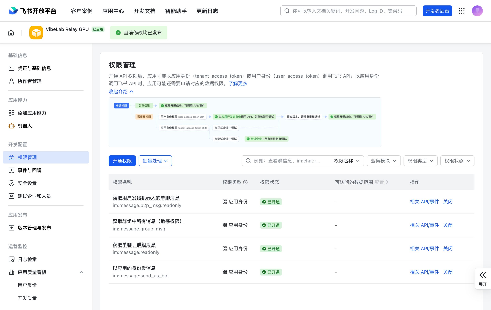
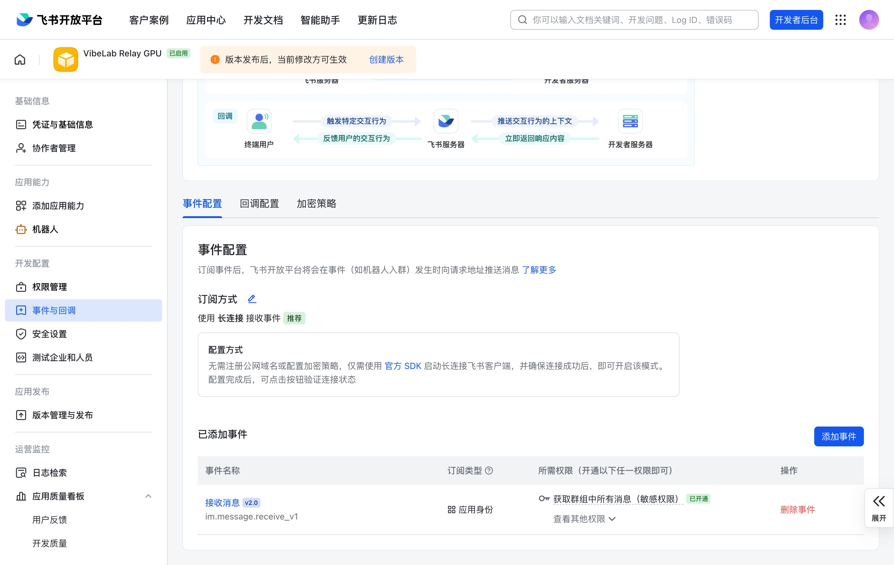
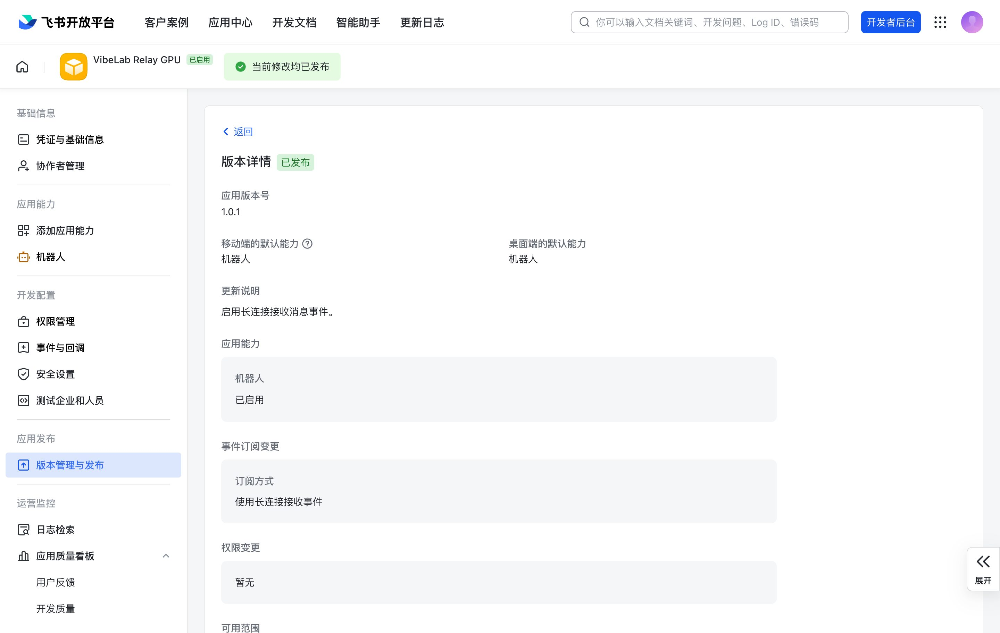

# Feishu Setup Guide

This guide explains how to configure Feishu as a VibeLab Relay channel.

## Prerequisites

- A Feishu organization account or developer permissions
- Access to the [Feishu Open Platform](https://open.feishu.cn/app)

## Create An Internal App

1. Open the [Feishu Open Platform](https://open.feishu.cn/app) and sign in.
2. Create an internal enterprise app.
3. Fill in the app name, for example `VibeLab Relay`, and a short description.
4. Open the app detail page.

## Add Bot Capability

1. In the app detail page, open **Add App Capability**.
2. Add **Bot**.

## Save Credentials

From **Credentials and Basic Info**, save:

- **App ID**, such as `cli_xxxx`
- **App Secret**

Store the secret only in the protected relay configuration (`chmod 600`). Do
not paste it into shell history, screenshots, issues, or chat messages. If it is
ever exposed, rotate it before continuing.

## Configure Permissions

Open **Permissions Management** and enable the required message permissions:

| Permission | Identifier | Purpose |
| --- | --- | --- |
| Receive direct bot messages | `im:message.p2p_msg:readonly` | Direct-chat discovery and testing |
| Receive all group messages | `im:message.group_msg` | Topic replies without requiring an @mention |
| Read direct and group messages | `im:message:readonly` | Bounded history recovery and reconciliation |
| Send messages as bot | `im:message:send_as_bot` | Root notifications and threaded replies |

These are the four permissions used by the relay. Keep the permission set
minimal instead of enabling every `im:message.*` permission.



## Publish The First Version

You must publish an app version before long-connection settings can be saved:

1. Open **Version Management and Release**.
2. Create a version, for example `1.0.0`.
3. Submit and publish it.

## Configure Event Subscription

After publishing, start the relay daemon on the designated host, or briefly
start an SDK WebSocket client that reads the credentials from a protected
configuration file. Feishu requires a successful connection before saving
long-connection event settings. Do not place the App Secret directly in a
command line.

While that connection is running:

1. Open **Events and Callbacks** in the Feishu app.
2. Choose long connection event receiving.
3. Save the setting.
4. Add event `im.message.receive_v1`.
5. Publish a new app version, for example `1.1.0`.





## Add The Bot To A Group

Use a dedicated Feishu group for the production relay target:

1. Open the group in the Feishu desktop client.
2. Open **More > Settings > Group Bots**.
3. Click **Add Bot**, search for the app name, and add it.

Feishu currently exposes this application-bot flow in the desktop client; the
web client may show the group-bot page without the **Add Bot** action. Use a
group rather than the bot's direct chat so group replies stay on the primary
WebSocket path and can be routed by topic root.

## Get The Chat ID

The daemon can discover the Feishu `chat_id` when the bot receives a group
message:

1. Start the daemon with the new App ID and App Secret.
2. Send a message in the dedicated group. An @mention is not required with the
   permissions above.
3. Read the latest structured `Received message` record from the daemon log:

```bash
node - <<'NODE'
const fs = require('node:fs');
const path = `${process.env.HOME}/.vibelab-tools/agent-skills/relay/runtime/daemon.log`;
const rows = fs.readFileSync(path, 'utf8').trim().split('\n').reverse();

for (const line of rows) {
  try {
    const row = JSON.parse(line);
    if (row.module === 'feishu' && row.msg === 'Received message' && row.source === 'websocket') {
      console.log(row.chatId);
      break;
    }
  } catch {}
}
NODE
```

The command prints a value like `oc_xxxx`; save it as `feishu.chat_id`. Treat
the ID as operational configuration and do not paste it into public issues.

## Configure The Daemon

Add the required variables to
`~/.vibelab-tools/agent-skills/relay/config.json`:

```json
{
  "feishu": {
    "app_id": "<your-app-id>",
    "app_secret": "<your-app-secret>",
    "chat_id": "<your-chat-id>",
    "proxy": { "enabled": false }
  }
}
```

Keep this file mode `600`, restart the designated relay daemon, and leave every
other machine's daemon stopped. One Feishu app should have only one active
relay WebSocket client.

## How It Works

```text
Agent notification -> daemon -> group session topic -> threaded notification
User topic reply -> Feishu WebSocket (primary) -> daemon -> tmux
Missed/reconnect input -> bounded recovery scan -> daemon -> tmux
```

## Session Isolation

Feishu uses one stable topic root per session to keep messages grouped and routable:

1. On the first notification, the daemon sends a root message to the group.
2. The root becomes the `feishuRootMessageId` for the tmux session.
3. Later notifications are sent as threaded replies under that same root.
4. Completion and ask-user replies mention the group to trigger attention.
5. User replies in that topic are routed back to the matching tmux session.
6. A bounded recovery scheduler checks at most one live session topic every 15
   seconds and prioritizes topics that recently received a notification.
7. Recovery positions and message IDs are persisted so daemon restarts and
   WebSocket reconnects do not replay already handled input.
8. Bindings for missing tmux sessions are skipped immediately and removed only
   after they remain absent for 24 hours.

No manual topic creation is required. Each Claude Code or Codex session creates
its topic automatically and keeps using that binding.

## Platform Comparison

| Feature | Telegram | DingTalk | Feishu |
| --- | --- | --- | --- |
| Isolation | Forum Topic | Group | Session Topic |
| Worker required | Yes | No | No |
| Connection | Webhook -> Worker -> Poll | Stream SDK | SDK WSClient |
| Bot mention required | No | Yes | Depends on permissions |
| Auto-create channel | Yes | No | Yes |

## Known Issues

- Long-connection configuration can be saved only after at least one app
  version is published and an SDK connection succeeds.
- Feishu defaults to direct network access. To use a proxy, set
  `feishu.proxy.enabled=true` with `feishu.proxy.url` or split proxy fields.
- A Feishu app supports one active WebSocket connection at a time. Multiple
  daemon instances should not share the same app.
- Use a group as `feishu.chat_id`. Direct bot chat is useful for discovery and
  testing, but it is not the production topic-routing target.
- Users must reply inside the latest Feishu Topic so the daemon can identify
  the matching root message.
